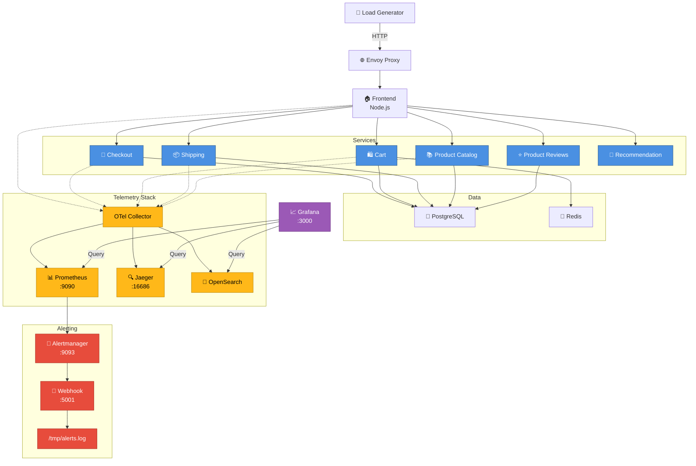

# OpenTelemetry Demo - MLT-Focused Minimal Stack

## System Architecture



## Quick Start

### Start the Stack
```bash
docker compose -f docker-compose.minimal.yml up -d
```

### Access Services

| Service | URL | Purpose |
|---------|-----|---------|
| **Grafana** | http://localhost:3000 | Dashboards & Visualization |
| **Prometheus** | http://localhost:9090 | Metrics Database |
| **Alertmanager** | http://localhost:9093 | Alert Management |
| **Jaeger** | http://localhost:16686 | Distributed Tracing |
| **Frontend** | http://localhost:80 | Application UI |
| **Webhook Server** | http://localhost:5001/health | Alert Receiver |

### Monitor Alerts
```bash
# Watch alerts in real-time
tail -f /tmp/alerts.log

# Or query Alertmanager
curl -s http://localhost:9093/api/v1/alerts | jq .
```

### View Metrics
```bash
# Query Prometheus for active alerts
curl -s http://localhost:9090/api/v1/rules | jq '.data.groups[0].rules[] | {name, state}'

# Check alert evaluation
curl -s http://localhost:9090/api/v1/query?query='up' | jq '.data.result | length'
```

## Services (9 Microservices)

| Service | Language | Type | Port |
|---------|----------|------|------|
| Frontend | Node.js | HTTP | 8080 |
| Checkout | Go | gRPC | 5050 |
| Cart | .NET | gRPC | 7070 |
| Currency | C++ | gRPC | 7001 |
| Shipping | Go | gRPC | 50050 |
| Quote | PHP | HTTP | 8090 |
| Product Catalog | Go | gRPC | 3550 |
| Product Reviews | Python | HTTP | 3551 |
| Recommendation | Python | HTTP | 9001 |

## Observability Components

### Metrics (Prometheus)
- ✅ Scrapes all 9 services
- ✅ 10 production alert rules
- ✅ HTTP error rates, latency thresholds, DB saturation
- ✅ Evaluation interval: 30 seconds

### Tracing (Jaeger)
- ✅ Distributed tracing across microservices
- ✅ Service dependency visualization
- ✅ Latency analysis and sampling

### Logging (OpenSearch)
- ✅ Aggregated logs from all services
- ✅ Full-text search and analysis
- ✅ Real-time log streaming

### Alerting (Alertmanager + Webhook)
- ✅ 10 production-grade alert rules
- ✅ HTTP 5xx error detection
- ✅ Latency spike detection (HTTP, RPC, DB)
- ✅ Connection pool saturation
- ✅ OTel Collector health monitoring
- ✅ Webhook routing to `/tmp/alerts.log`

## Alert Rules

All alert rules use **real metrics** extracted from Grafana dashboards:

```
1. HighHTTPErrorRate (Critical)
   - Triggers: Error rate > 5% sustained for 1 min
   - Metric: http_server_request_duration_seconds{http_response_status_code=~"5.."}

2. HighHTTPLatency (Warning)
   - Triggers: P95 latency > 500ms sustained for 2 min
   - Metric: histogram_quantile(0.95, http_server_request_duration_seconds_bucket)

3. HighRPCErrorRate (Warning)
   - Triggers: RPC error rate > 10% sustained for 1 min
   - Metric: rpc_server_duration_milliseconds_count{rpc_grpc_status_code!="0"}

4. HighRPCLatency (Warning)
   - Triggers: RPC P95 > 500ms sustained for 2 min
   - Metric: histogram_quantile(0.95, rpc_server_duration_milliseconds_bucket)

5. HighDatabaseLatency (Warning)
   - Triggers: DB P95 > 1.0s sustained for 2 min
   - Metric: histogram_quantile(0.95, db_client_operation_duration_seconds_bucket)

6. DatabaseConnectionPoolSaturation (Warning)
   - Triggers: Pool > 80% full sustained for 1 min
   - Metric: db_sql_connection_open / db_sql_connection_max_open

7. OTelCollectorReceiverDrops (Warning)
   - Triggers: Any span drops detected
   - Metric: rate(otelcol_receiver_refused_spans_total[5m]) > 0

8. OTelCollectorExporterFailures (Warning)
   - Triggers: Export failures detected
   - Metric: rate(otelcol_exporter_send_failed_spans_total[5m]) > 0

9. OTelCollectorQueueFull (Critical)
   - Triggers: Queue > 80% capacity sustained for 1 min
   - Metric: otelcol_exporter_queue_size / otelcol_exporter_queue_capacity

10. HTTPRequestsSpike (Info)
    - Triggers: > 100 active requests sustained for 1 min
    - Metric: http_server_active_requests
```

## Traffic Flow

1. **Load Generator** → Creates sustained traffic via HTTP
2. **Envoy Proxy** → Routes traffic to Frontend on port 8080
3. **Frontend** → Orchestrates requests to microservices (mixed HTTP/gRPC)
4. **Services** → Process requests, emit telemetry signals
5. **OTel Collector** → Aggregates metrics, traces, logs
6. **Prometheus** → Evaluates alert rules every 30 seconds
7. **Alertmanager** → Routes alerts via webhook
8. **Flask Webhook** → Writes alerts to `/tmp/alerts.log`
9. **Observability Agent** → Consumes alerts for incident triage

## Key Files

- **docker-compose.minimal.yml** - Main orchestration file
- **src/prometheus/alert-rules.yml** - 10 production alert rules
- **src/prometheus/alert-webhook-server.py** - Flask webhook receiver
- **src/prometheus/alertmanager.yml** - Alert routing configuration
- **src/prometheus/prometheus-config.yaml** - Metrics scrape config
- **.env** - Environment variables (ports, addresses, credentials)

## Notes

- All services use pre-built images (no local builds in minimal stack)
- Healthchecks disabled for fast startup
- Alert webhook writes to `/tmp/alerts.log` for agent consumption
- Prometheus scrapes metrics on port 9090 (internal)
- All dashboards available in Grafana at http://localhost:3000
