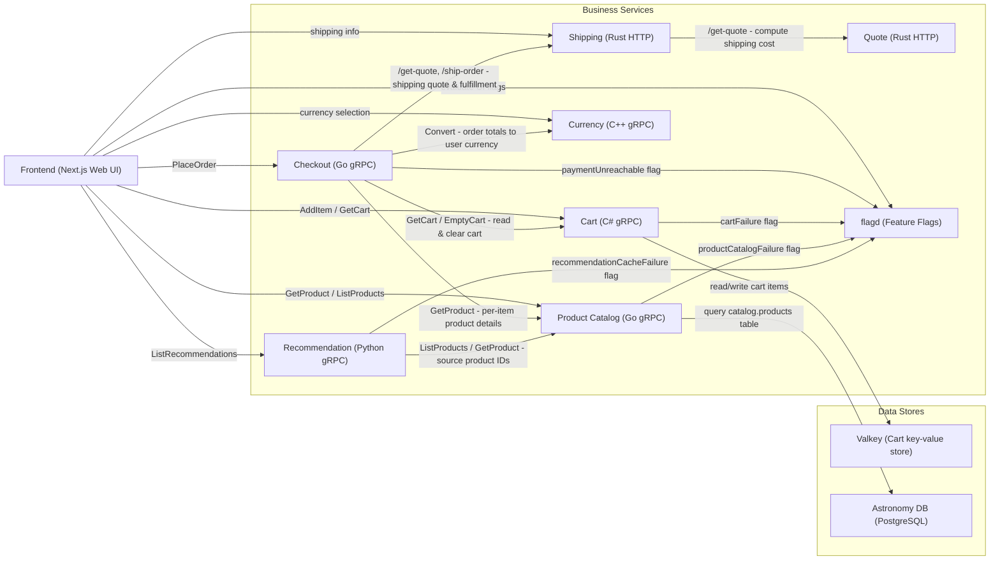
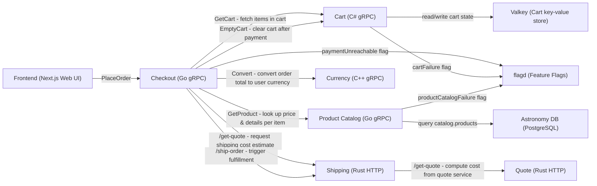
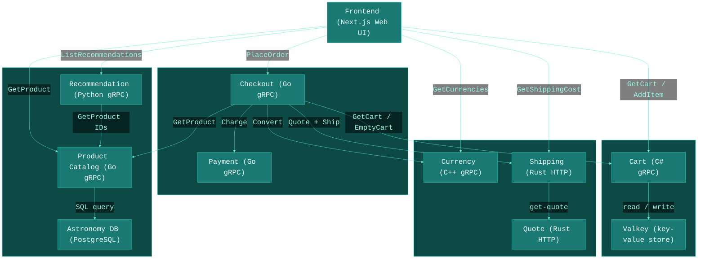
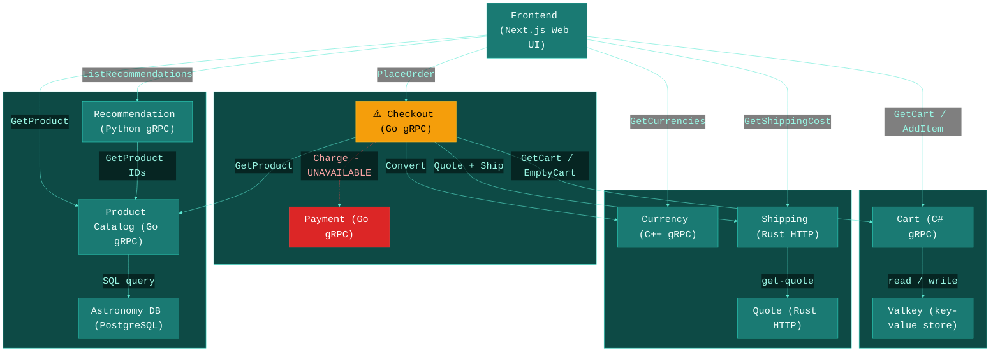

```mermaid
graph LR

  %% User & Traffic
  subgraph "User Traffic"
    user["User (Browser)"]
    loadgen["Load Generator (Locust)"]
    frontend_proxy["Frontend Proxy (Envoy)"]
    frontend["Frontend (Next.js Web UI)"]
  end

  loadgen -->|synthetic HTTP load| frontend_proxy
  user -->|browses shop / places orders| frontend_proxy
  frontend_proxy -->|routes HTTP to app| frontend

  %% Core Business Services
  subgraph "Core Business Services"
    cart["Cart (C# gRPC)"]
    checkout["Checkout (Go gRPC)"]
    product_catalog["Product Catalog (Go gRPC)"]
    recommendation["Recommendation (Python gRPC)"]
    currency["Currency (C++ gRPC)"]
    shipping["Shipping (Rust HTTP)"]
    quote["Quote (Rust HTTP)"]
    flagd["flagd (Feature Flags)"]
  end

  %% Data Stores
  subgraph "Data Stores"
    valkey_cart["Valkey (Cart key-value store)"]
    astronomy_db["Astronomy DB (PostgreSQL)"]
  end

  %% Observability Stack
  subgraph "Telemetry & Observability"
    otel_collector["OTel Collector"]
    prometheus["Prometheus (metrics + alert rules)"]
    alertmanager["Alertmanager (alert routing)"]
    alert_webhook["Alert Webhook Server (RCA agent hook)"]
    jaeger["Jaeger (trace storage & UI)"]
    opensearch["OpenSearch (log storage)"]
    grafana["Grafana (dashboards)"]
  end

  %% Frontend -> Backend interactions
  frontend -->|AddItem / GetCart| cart
  frontend -->|PlaceOrder| checkout
  frontend -->|GetProduct / ListProducts| product_catalog
  frontend -->|ListRecommendations| recommendation
  frontend -->|price display / currency selection| currency
  frontend -->|shipping info for UI| shipping

  %% Checkout interactions
  checkout -->|GetCart / EmptyCart - read & clear cart| cart
  checkout -->|GetProduct - per-item product details| product_catalog
  checkout -->|Convert - order totals to user currency| currency
  checkout -->|/get-quote, /ship-order - shipping quote & fulfillment| shipping

  %% Cart internals
  cart -->|read/write cart items| valkey_cart
  cart -->|cartFailure flag| flagd

  %% Product Catalog internals
  product_catalog -->|query catalog.products table| astronomy_db
  product_catalog -->|productCatalogFailure flag| flagd

  %% Recommendation service
  recommendation -->|ListProducts / GetProduct - source product IDs| product_catalog
  recommendation -->|recommendationCacheFailure flag| flagd

  %% Shipping & Quote
  shipping -->|/get-quote - compute shipping cost| quote

  %% Feature flags fan-out
  frontend -->|evaluate UI flags| flagd
  checkout -->|paymentUnreachable flag| flagd

  %% Telemetry flow
  frontend -->|OTLP traces/metrics/logs| otel_collector
  cart -->|OTLP traces/metrics/logs| otel_collector
  checkout -->|OTLP traces/metrics/logs| otel_collector
  product_catalog -->|OTLP traces/metrics/logs| otel_collector
  recommendation -->|OTLP traces/metrics/logs| otel_collector
  currency -->|OTLP traces/metrics/logs| otel_collector
  shipping -->|OTLP traces/metrics/logs| otel_collector
  quote -->|OTLP traces/metrics/logs| otel_collector

  otel_collector -->|export metrics| prometheus
  otel_collector -->|export traces| jaeger
  otel_collector -->|export logs| opensearch

  prometheus -->|evaluate alert rules| alertmanager
  alertmanager -->|HTTP webhook| alert_webhook

  grafana -->|query metrics| prometheus
  grafana -->|query traces| jaeger
  grafana -->|query logs| opensearch

  frontend_proxy -->|expose Grafana/Jaeger UIs| grafana
  frontend_proxy -->|expose Grafana/Jaeger UIs| jaeger
```

---

## Frontend & Business Services (no observability)

---

## Checkout Flow (order placement detail)

---

## Business Services Only (no flagd, no observability)

---

## Alert: OperationalAnomalyDetected — paymentUnreachable

