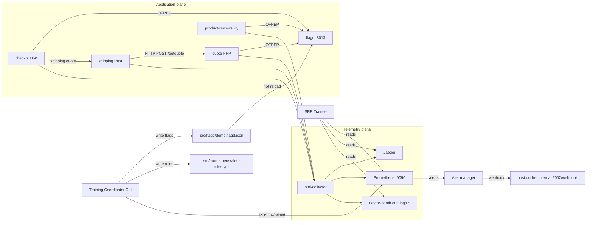
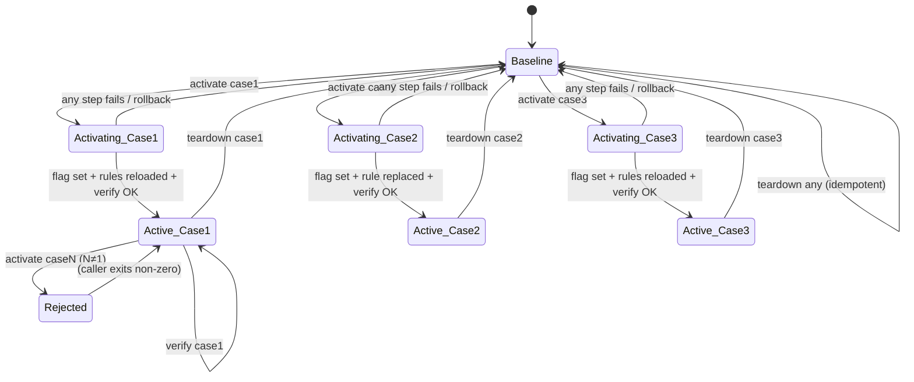
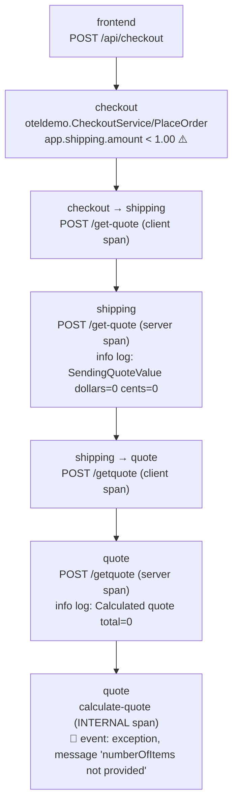

# Design Document

## Overview

This feature adds three fault-injection training scenarios to the OpenTelemetry Demo stack (astronomy e-commerce microservices under `docker-compose.minimal.yml`). Each scenario is activated by a single `scenarios.py` CLI invocation, surfaces to the SRE_Trainee as exactly **one** Prometheus alert, and is fully reversible without container restarts for the flag toggles.

The design deliberately treats **the alert text itself as the primary difficulty dial**. Three alert tiers — Deceptive, Prescriptive, Terminal — are implemented as Prometheus rules with carefully tuned `annotations.summary` / `annotations.description` content. The underlying injection mechanisms are small, surgical edits to existing code paths rather than new failure logic.

| Case | Difficulty | Alert | Root Cause | Injection Surface |
|---|---|---|---|---|
| Case 1 | HARD / Deceptive | `AnomalousZeroValueOrders` | PHP `quote` silently returns `0` for 20–40% of `/getquote` calls, corrupting shipping cost downstream | OpenFeature gate at entry of `calculateQuote()` in `src/quote/app/routes.php` |
| Case 2 | EASY / Prescriptive | `PaymentServiceUnreachable` (replaces the typo-ridden `SomethingWrongHere`) | Checkout dials `badAddress:50051` for `oteldemo.PaymentService/Charge` | Existing `paymentUnreachable` branch in `src/checkout/main.go` |
| Case 3 | IMPOSSIBLE / Terminal | `ProductReviewsMemoryHigh` | Python `product-reviews` appends every request payload to a module-global list | OpenFeature gate at entry of the two gRPC handlers in `src/product-reviews/product_reviews_server.py` |

The normative telemetry contract for every active service (metric families, label dimensions, log indexes, trace operation names, documented gaps) lives in `service_map.yml` at the repository root and is referenced — not duplicated — throughout this document. The `service-map-observability-validator` (Req 9) reads it directly.

### Threat model for the SRE_Trainee (normative)

All three scenarios are designed against the following threat model, referred to below as **TM-A**:

- **What the trainee has.** Interactive access to Prometheus (`:9090`), Alertmanager (`:9093`), Grafana (`:3000`), Jaeger (`:16686`), and the OpenSearch `otel-logs-*` index via the Grafana OpenSearch datasource. They can issue arbitrary PromQL, OpenSearch DSL, and Jaeger search queries.
- **What the trainee does NOT have.** Read access to the repository source tree. No access to `src/flagd/demo.flagd.json`, `src/prometheus/alert-rules.yml`, `docker-compose.minimal.yml`, or the `src/**` service source. No access to `flagd-ui` (which is commented out in the minimal compose regardless). No shell inside containers. No access to `pg_stat_activity` or other non-ingested stores.
- **Implication for difficulty tuning.** Every scenario's difficulty must be achievable from the MLT surface alone. A trainee who "reads the source" is operating outside this threat model — design decisions here do not have to defend against that.
- **Implication for Case_1 and Case_2 RCA paths.** Neither RCA path ends with "open `src/flagd/demo.flagd.json`" or "open `flagd-ui`". Case_1 ends at the `exception` event on the `calculate-quote` span (the PHP runtime is identifiable from the span's `service.name=quote` resource attribute and `telemetry_sdk_language=php` on `target_info`, both of which are in Jaeger). Case_2 ends at the gRPC client span showing `peer.address=badAddress:50051` plus the corresponding ERROR log body.
- **Implication for Case_3.** The mechanism must produce no correlatable signal via any PromQL query a trainee might plausibly try. See § Components / 5 for the time-driven leak design that decorrelates memory growth from request rate specifically to close the Prometheus-correlation escape hatch.

Requirement 8.5 (trainee observes `quoteSilentCorruption=on` in the flagd file) is **vacuously satisfied** under TM-A because the trainee has no filesystem access. It is kept in the requirements for auditability and in case a future deployment re-enables flagd-ui.

### Alert tier → expected SRE first-read reaction (Req 1.9)

| Alert | First-read reaction the design induces |
|---|---|
| `AnomalousZeroValueOrders` | "Suspect payment or checkout arithmetic." (Deceptive — wastes ≥30 min before pivoting upstream.) |
| `PaymentServiceUnreachable` | "Payment service unreachable, open Jaeger for `service=checkout error=true`." (Prescriptive — RCA in <15 min.) |
| `ProductReviewsMemoryHigh` | "Memory leak on `product-reviews`, origin unclear; logs index returns nothing." (Terminal — unsolvable from telemetry alone.) |

---

## Architecture

### High-level topology

The feature introduces **one new component** (`scenarios.py`), **two new flagd flags** (`quoteSilentCorruption`, `productReviewsMemoryLeak`), **two small code-path additions** (counter in `checkout`, leak list in `product-reviews`), **one gate added** to an existing branch in `quote`, and **three new Prometheus alert rules** (one of which replaces `SomethingWrongHere` in place).



### Compose constraints honored by this design

The target compose file is `docker-compose.minimal.yml`. The following services are **commented out and unavailable**: `ad`, `email`, `image-provider`, `flagd-ui`, `llm`, `kafka`, `accounting`, `fraud-detection`. As a direct consequence:

- Case 1 cannot rely on Kafka/accounting/fraud-detection evidence trails.
- Case 2 can rely on the existing `payment` container (it is active in the minimal compose).
- Case 3 scopes the leak to the two `ProductReviewService` handlers that do **not** transit `llm` (`GetProductReviews`, `GetAverageProductReviewScore`). `AskProductAIAssistant` is out of scope because the `llm` container is down.
- `flagd-ui` inspection at port 4000 is unavailable by default. Training_Coordinator and SRE_Trainee inspection is via the filesystem copy of `src/flagd/demo.flagd.json`.

### Runtime mechanics of activation

Flagd is launched with `--uri file:./etc/flagd/demo.flagd.json` and watches the file for changes — see `docker-compose.minimal.yml` `flagd` service. No container restart is needed when flipping a flag. Prometheus is launched with `--web.enable-lifecycle`, so alert-rule changes are applied by `POST http://prometheus:9090/-/reload`. This is the single reload mechanism Case 1 and Case 3 use (Case 2 already has its rule present — we only edit the rule text in place).

---

## Components and Interfaces

### 1. Scenario_Controller (`scenarios/scenarios.py`)

**Purpose.** The single CLI entry point for the Training_Coordinator. Owns the state machine for activate / verify / teardown and enforces mutual exclusion.

**Location.** `scenarios/scenarios.py` at the repo root, alongside a small package:

```
scenarios/
  scenarios.py                  # CLI entry point
  controller.py                 # State machine, idempotence, mutual exclusion
  flagd_client.py               # Read/write src/flagd/demo.flagd.json atomically
  prometheus_client.py          # POST /-/reload + query HTTP API
  opensearch_client.py          # _search over otel-logs-*
  jaeger_client.py              # /api/traces query
  state_file.py                 # JSON state persisted to ./.scenario-state.json
  # (no runbooks/ directory — alert description is the entry-point document; see § 9)
  tests/
    test_properties.py          # Hypothesis property-based tests (Req 10)
```

**CLI surface.**

```
python -m scenarios.scenarios activate {case1|case2|case3}
python -m scenarios.scenarios verify   {case1|case2|case3}
python -m scenarios.scenarios teardown {case1|case2|case3|all}
python -m scenarios.scenarios status
python -m scenarios.scenarios solve    {case1|case2|case3} [--timed-out]
```

**Activation state machine (Req 11, Req 2).**



**State file.** `./.scenario-state.json` persists `{active_scenario, activated_at, solve_marker, solved_at}` so that:
- Mutual exclusion (Req 11.3) survives CLI process restarts.
- Idempotent activation/teardown (Req 11.5, 11.6) is deterministic.
- Time-to-solve reporting (Req 13.1) is durable.

**Activation sequence (happy path — Case 1 shown; Case 2 and Case 3 are variants).**

1. Acquire POSIX advisory lock on `./.scenario-state.json`. If another scenario is active with a different identifier → refuse, exit 2.
2. Read `src/flagd/demo.flagd.json` into memory; snapshot to `./.scenario-backup.json`.
3. Set `flags.quoteSilentCorruption.defaultVariant` to `"on"`; write atomically (`tempfile + os.replace`). Flagd hot-reloads within ~1 s.
4. Read `src/prometheus/alert-rules.yml`; ensure `AnomalousZeroValueOrders` rule is present (merge, not replace). Write atomically.
5. `POST http://localhost:9090/-/reload`. Expect `200`. On non-200, restore backup and exit non-zero (Req 2.7).
6. Poll Prometheus `/api/v1/rules` for the rule to appear (≤5 s).
7. Update state file: `active_scenario=case1, activated_at=<now>`.
8. Print to stdout (Req 2.6) — visible to the Training_Coordinator only, not to the SRE_Trainee:
   - Scenario ID: `case1`
   - Expected alert: `AnomalousZeroValueOrders`
   - Expected time-to-fire: `≤ 300 s`
   - Training_Coordinator inspection URL: `http://localhost:4000/?flag=quoteSilentCorruption` (flagd-ui is NOT running under the minimal compose; this URL only resolves if the coordinator has uncommented the `flagd-ui` container. Under the default minimal compose the coordinator inspects the flag by reading `src/flagd/demo.flagd.json` directly from the repo checkout. Neither path is exposed to the SRE_Trainee under TM-A.)

**Teardown sequence.**

1. Acquire lock.
2. Flip flag back to `off`, write atomically.
3. Optionally remove alert rule (configurable — default is to leave it in place to minimize reload thrash). Prometheus reload.
4. Case 3 only: exec `docker compose restart product-reviews` to release the leaked list (Req 7.12.b). Case 1 and Case 2 require no restart (Req 5.5.c, Req 6.9).
5. Clear state file.

**Rollback on mid-activation failure.** If step N fails, steps 1..(N-1) are reversed by restoring `./.scenario-backup.json` over `src/flagd/demo.flagd.json` and re-POSTing `/-/reload`. Exit status is `3` and the message names the failed step.

### 2. Flagd flag definitions (`src/flagd/demo.flagd.json`)

Two new flags added additively (Req 12.1). Existing flags are untouched.

```json
"quoteSilentCorruption": {
  "description": "Fault injection: Case 1 — do not toggle during training.",
  "state": "ENABLED",
  "variants": { "on": true, "off": false },
  "defaultVariant": "off"
},
"productReviewsMemoryLeak": {
  "description": "Fault injection: Case 3 — do not toggle during training.",
  "state": "ENABLED",
  "variants": { "on": true, "off": false },
  "defaultVariant": "off"
}
```

The `paymentUnreachable` flag is pre-existing and currently ships with `defaultVariant: "on"` (ARCHITECTURE_NOTES.md confirms). Baseline measurement requires a one-time edit to set it `off` before training begins (Req 12.3). Case 2 activation flips it back to `on`.

### 3. Case 1 injection site — `src/quote/app/routes.php`

**Edit site.** Entry of `calculateQuote($jsonObject)`, **before** the `try` block. No change to the exception handling itself — the existing `throw new \InvalidArgumentException('numberOfItems not provided')` branch and its `$childSpan->recordException($exception)` call are the intended recorded event.

**Shape of the edit** (≤15 lines, conceptual):

```php
function calculateQuote($jsonObject): float
{
    $quote = 0.0;
    $childSpan = Globals::tracerProvider()->getTracer('manual-instrumentation')
        ->spanBuilder('calculate-quote')->setSpanKind(SpanKind::KIND_INTERNAL)->startSpan();
    $childSpan->addEvent('Calculating quote');
    try {
        // NEW: Case 1 injection. Flag read once per call. 20-40% corruption window.
        $client = OpenFeature\OpenFeatureAPI::getInstance()->getClient();
        if ($client->getBooleanValue('quoteSilentCorruption', false)) {
            if (mt_rand(0, 99) < random_int(20, 40)) {
                unset($jsonObject['numberOfItems']); // falls into existing throw branch below
            }
        }
        if (!array_key_exists('numberOfItems', $jsonObject)) {
            throw new \InvalidArgumentException('numberOfItems not provided');
        }
        // ... existing code unchanged ...
```

This gates entry into the existing failure branch — it is **not new failure logic** (requirement-summary point 7). The caller (`Shipping_Service` Rust) parses `"0"` into `f64 0.0`, which flows to `create_quote_from_float(0.0)` → `Quote { dollars: 0, cents: 0 }` → `Money { units: 0, nanos: 0 }`.

**OpenFeature PHP SDK.** The quote service runs under `OTEL_PHP_AUTOLOAD_ENABLED=true` (compose file). We add `open-feature/sdk` and `open-feature/flagd-provider` to `src/quote/composer.json` and register the provider in `src/quote/app/dependencies.php`. Flag reads are cheap (in-process gRPC stream).

### 4. Case 1 observability add — counter in `src/checkout/main.go`

**Edit site.** Top of file: declare meter + counter. Inside `PlaceOrder`, immediately after the existing `shippingCostFloat, _ := strconv.ParseFloat(...)` line (around line 366), add a single increment. Leverages the existing `shippingCostFloat` computation — no new float parsing.

**Counter shape (Req 3.9).**

- Instrument name: `app_order_shipping_cost_usd_total`
- Unit: `{order}`
- Labels: `bucket` ∈ `{zero, nonzero}`
- Bucketing rule: `bucket="zero"` if `shippingCostFloat < 1.00`, else `bucket="nonzero"`.

This is the **PromQL-observable** signal that underpins the Case 1 alert. We chose a counter (not a gauge) so that PromQL `rate(...[5m])` works cleanly. We chose `bucket="zero"` (not `< 0.01`) because the Rust `quote.rs` `create_quote_from_float` floors to integer dollars, making sub-dollar corrupted values indistinguishable from corrupted-zero.

### 5. Case 3 injection site — `src/product-reviews/product_reviews_server.py`

**Design objective.** Produce monotonic memory growth that cannot be correlated with request rate via any PromQL a trainee might run under TM-A. Specifically, plotting `process_memory_usage_bytes{service_name="product-reviews"}` against `rate(traces_span_metrics_calls_total{service_name="product-reviews", span_kind="SPAN_KIND_SERVER"}[5m])` must show **no meaningful correlation**. A trainee observing a non-trivial correlation would rightly conclude "memory tracks requests → accumulated per-request state" and narrow their hypothesis space.

**Mechanism.** A **time-driven background leaker** running inside the `product-reviews` Python process, independent of the gRPC request path. A single module-global `threading.Thread` started at server boot appends a fixed-size opaque payload to a module-global list at a steady wall-clock cadence, gated by the flag. Because the leaker is never invoked from a request handler, request rate has zero influence on leak rate.

**Edit site.** Top of `src/product-reviews/product_reviews_server.py`, module-level. **No edits inside any `ProductReviewService` method** — this is deliberate. Handler bodies stay pristine and a trainee inspecting span durations or span counts sees nothing anomalous on the request path.

**Shape (≤25 lines, conceptual).**

```python
import threading
import time

_LEAK_SINK: list[bytes] = []            # module-global, never truncated
_LEAK_CHUNK = b"\x00" * (1024 * 1024)   # 1 MiB opaque bytes; GC-invisible (no refs inside)

def _memory_leaker() -> None:
    """Time-driven leaker. Wakes every ~2s; appends 1 MiB if flag is on.
    Completely independent of inbound request handlers."""
    while True:
        try:
            if check_feature_flag("productReviewsMemoryLeak"):
                # ~1 MiB per tick, ~30 MiB/min, ~450 MiB in 15 min (breaches alert at ~13 min)
                _LEAK_SINK.append(_LEAK_CHUNK)
        except Exception:
            pass  # never raise — this thread MUST NOT surface anywhere in telemetry
        time.sleep(2.0)

# Started once at module import, before the gRPC server starts accepting requests
threading.Thread(target=_memory_leaker, name="bg-housekeeper", daemon=True).start()
```

**Key design decisions and their rationale.**

1. **Constant-size 1 MiB `bytes` chunks, not serialized protobuf payloads.** `bytes` objects hold no Python object references, so the Python GC's `cpython_gc_collected_objects_total` counter does **not** change behavior as `_LEAK_SINK` grows. This closes the escape hatch where a trainee infers "GC is collecting less → heap is growing" from runtime metrics alone.
2. **`time.sleep(2.0)` cadence, not a per-request trigger.** This is the critical decorrelation: with or without request traffic, the sink grows at ~30 MiB/min. A trainee plotting memory-vs-request-rate sees a flat horizontal relationship — memory grows the same at 0 rps as at 100 rps. The leak is not driven by, or correlated with, any handler-level signal.
3. **Thread name `"bg-housekeeper"`.** If Python runtime metrics happen to label thread counts (they don't by default under OTel Python auto-instrumentation — only `process_thread_count` exists, an unlabeled gauge), the name offers no hint. A trainee inspecting `process_thread_count` before and after flag flip sees a +1 thread — which is also what any benign housekeeping thread would show, and the alert's four-step investigation list does not mention thread counts at all.
4. **No request-handler edits.** `GetProductReviews`, `GetAverageProductReviewScore`, and `AskProductAIAssistant` are not touched. Span durations, span counts, and error rates on the request path are indistinguishable from Baseline — so an SRE's first instinct (check handler golden signals) yields nothing.
5. **Broad `except Exception: pass`.** The leaker thread must never crash visibly: an unhandled exception in a Python thread is logged via the default threading hook, and `product-reviews` would then emit its first OpenSearch log record ever — which would immediately break the "`productreviews.logs: null`" property. The silent exception swallow is load-bearing for the terminal alert tier.

**Leak rate math.** 1 MiB per 2-second tick = 30 MiB/min. The 500 MB container limit is breached at ~13 minutes, comfortably inside the 15-minute alert firing budget (Req 7.9). The alert `for: 5m` gate means the alert transitions to `firing` at ~18 minutes after flag flip in the worst case — we tighten the cadence to 1.5 s if field testing shows drift (this is a tuning knob, not a design risk).

**What the trainee sees in PromQL under TM-A.**

| Query | Result | Trainee conclusion |
|---|---|---|
| `process_memory_usage_bytes{service_name="product-reviews"}` | Monotonic climb at ~500 KB/s | "Memory is leaking." ✅ |
| `rate(traces_span_metrics_calls_total{service_name="product-reviews", span_kind="SPAN_KIND_SERVER"}[5m])` | Steady, matches baseline | "Request rate hasn't changed." |
| Memory vs request-rate correlation on any window | Flat, near-zero R² | "Leak is not request-driven." ← **new dead end** |
| `cpython_gc_collections_total`, `cpython_gc_collected_objects_total` | Baseline rates unchanged | "GC behavior looks normal." |
| `traces_span_metrics_calls_total{service_name="product-reviews", status_code="STATUS_CODE_ERROR", span_kind="SPAN_KIND_SERVER"}` | Zero | "No server-side errors." |
| `otel-logs-*` filtered on `resource.service.name.keyword:"product-reviews"` | Zero hits | "Service emits no logs at all." |

The trainee has four independent signals, all pointing away from the request handlers. There is no PromQL, no OpenSearch query, and no Jaeger search that narrows further. The scenario is unsolvable from MLT alone — which is the intended terminal training outcome.

### 6. Case 2 injection site — already present

`src/checkout/main.go` `chargeCard()` already contains:

```go
if cs.isFeatureFlagEnabled(ctx, "paymentUnreachable") {
    badAddress := "badAddress:50051"
    c := mustCreateClient(badAddress)
    paymentService = pb.NewPaymentServiceClient(c)
}
```

No code edit is required for Case 2 — only the flag flip and the alert-rule replacement.

### 7. Alert rules — `src/prometheus/alert-rules.yml`

All three rules live in the existing `observability_agent_alerts` group, at 30 s evaluation interval.

#### Rule: `AnomalousZeroValueOrders` (Case 1 — Deceptive, Req 4)

```yaml
- alert: AnomalousZeroValueOrders
  expr: |
    (
      sum(rate(app_order_shipping_cost_usd_total{service_name="checkout", bucket="zero"}[5m]))
      /
      sum(rate(app_order_shipping_cost_usd_total{service_name="checkout"}[5m]))
    ) > 0.15
  for: 2m
  labels:
    severity: warning
    scenario: case1
  annotations:
    summary: |
      Elevated rate of zero-value orders detected in checkout — possible payment or pricing issue
    description: |
      Over 15% of orders placed in the last 5 minutes have shipping cost under $1.
      Investigate payment service charge logic and verify checkout arithmetic for cart totals.
      This may indicate a checkout pricing regression, a currency conversion zero-rate,
      or a payment processor discount rule misconfiguration.
```

Deception checklist (Req 4.3, 4.4, 1.2): the `summary` never mentions `quote`, `PHP`, `numberOfItems`, `calculate-quote`, `shipping service`, or `Rust`; the `description` enumerates three red-herring hypotheses (payment, checkout arithmetic, currency).

#### Rule: `PaymentServiceUnreachable` (Case 2 — Prescriptive, Req 6.5, 6.10)

Replaces the existing `SomethingWrongHere` block in place. All other alert blocks in the file remain unchanged.

```yaml
- alert: PaymentServiceUnreachable
  expr: |
    (
      sum by (rpc_method) (
        rate(rpc_client_call_duration_seconds_count{
          service_name="checkout",
          rpc_method="oteldemo.PaymentService/Charge",
          rpc_response_status_code="UNAVAILABLE"
        }[5m])
      )
      /
      sum by (rpc_method) (
        rate(rpc_client_call_duration_seconds_count{
          service_name="checkout",
          rpc_method="oteldemo.PaymentService/Charge"
        }[5m])
      )
    ) > 0.5
  for: 1m
  labels:
    severity: critical
    scenario: case2
    rpc_method: "oteldemo.PaymentService/Charge"
  annotations:
    summary: |
      oteldemo.PaymentService/Charge UNAVAILABLE from checkout
    description: |
      Over 50% of oteldemo.PaymentService/Charge calls from checkout returned gRPC UNAVAILABLE in the last 5 minutes.
      Jaeger search: service=checkout error=true
      OpenSearch query: resource.service.name.keyword:checkout AND severity.text:ERROR
```

Req 1.4 literal substrings are all present in `summary`: `oteldemo.PaymentService/Charge`, `checkout`, `UNAVAILABLE`. Req 1.5 Jaeger and OpenSearch queries are in `description`.

#### Rule: `ProductReviewsMemoryHigh` (Case 3 — Terminal, Req 7.7, 7.8)

**Primary expression (preferred)**: ratio against docker_stats-derived container limit. `service_map.yml` does not currently catalogue a `container_memory_usage_limit_bytes` metric, and the otel-collector's `docker_stats` receiver emits `container.memory.usage.limit` — surfaced to Prometheus as `container_memory_usage_limit_bytes` with label `container_name`. **We verify at validator runtime** whether that series is present; if not, we fall back to the static threshold.

**Fallback expression (per Req 7.7 alternative path)**: static 400 MB threshold, which is 80% of the 500 MB container limit in `docker-compose.minimal.yml` for `product-reviews`.

```yaml
- alert: ProductReviewsMemoryHigh
  expr: |
    (
      process_memory_usage_bytes{service_name="product-reviews"}
      /
      on() group_left()
      (container_memory_usage_limit_bytes{container_name="product-reviews"} > 0)
    ) > 0.80
    OR
    process_memory_usage_bytes{service_name="product-reviews"} > 400000000
  for: 5m
  labels:
    severity: warning
    scenario: case3
  annotations:
    summary: |
      product-reviews memory elevated (>80% of container limit) — limited forensic data available
    description: |
      product-reviews container memory usage has exceeded 80% of its limit for 5 minutes.
      Investigative steps you may attempt:
      1. Inspect process_memory_usage_bytes{service_name="product-reviews"} trend — this WILL show a monotonic climb.
      2. Inspect traces_span_metrics_calls_total{service_name="product-reviews", status_code="STATUS_CODE_ERROR"} — this WILL NOT show elevated errors (see service_map.yml: productreviews.logs: null; only SPAN_KIND_CLIENT flagd reconnect errors are recorded).
      3. Query OpenSearch otel-logs-* for resource.service.name.keyword:"product-reviews" — this WILL NOT return records. The service does not log to OpenSearch by design (service_map.yml documents this gap).
      4. Inspect cpython_gc_* — this WILL NOT differentiate leak from baseline allocation.
      This scenario is intentionally unsolvable from telemetry alone.
```

Req 1.6 literal substring `limited forensic data available` is present. Req 1.7 enumerates four investigative steps with a WILL/WILL NOT verdict for each.

### 8. `service-map-observability-validator` (Req 9)

**Purpose.** For every service entry in `service_map.yml`, prove that the declared telemetry is actually emitted by the live demo — and that documented gaps (e.g., `productreviews.logs: null`) remain true. Executes in ≤60 s.

**CLI.**

```
python -m scenarios.validator               # walks all services
python -m scenarios.validator --service quote
```

**Execution model.** The validator parallelizes per-service probes with `asyncio.gather` (bounded concurrency = 8) and returns a structured diff report. For each service entry it performs three probes:

1. **Metrics probe.** For every `metrics[*].name`, issue one Prometheus instant query:
   `count({__name__="<name>", service_name="<svc>"})` via `GET /api/v1/query`. A non-zero result over the 5-minute implicit lookback is a pass. **We do not enumerate label combinations** — that would blow the 60 s budget. Label dimensions are spot-checked in a separate `--deep` mode (not in the budget).
2. **Logs probe.** If `logs` is `null`, assert zero documents — issue a `_count` query with filter `resource.service.name.keyword:<value>` over the last 5 minutes. If `logs` is a block, issue a `_search` with `size:1` and `@timestamp: [now-5m, now]` filter; a single hit is pass.
3. **Traces probe.** For each `traces.server_operations[*]`, issue `GET /api/traces?service=<jaeger_service>&operation=<op>&lookback=5m&limit=1`. One trace is pass.

**60-second budget math.** `service_map.yml` has 14 active-service entries (frontend, checkout, cart, product-catalog, currency, shipping, quote, payment, recommendation, product-reviews, flagd, valkey, postgres, otel-collector). With ~120 metric names total, 10 log probes, and ~30 trace operations, serialized this is ~160 HTTP round-trips. At 50 ms each with concurrency 8, expected wall time is ~1–2 s. The 60 s cap is a ceiling, not a target.

**Diff output (Req 9.6).** JSON schema: `{service, signal_kind, expected, observed, verdict}`. On any `verdict=missing` the process exits `1`. Example:

```json
{"service": "product-reviews", "signal_kind": "log_present", "expected": "null (documented gap)", "observed": "0 documents", "verdict": "pass"}
{"service": "quote", "signal_kind": "metric", "expected": "quotes_total", "observed": "no series", "verdict": "missing"}
```

### 9. Runbook pages — REMOVED (Req 1.8 amended)

Earlier drafts of this design proposed a `scenarios/runbooks/` directory of markdown pages, with each alert carrying a `runbook_url` pointing to the corresponding page. **That approach has been dropped.** Each alert's `annotations.description` already carries the full investigation guidance required by Requirements 1.3 (Case 1 red-herring hint), 1.5 (Case 2 direct-query hint), and 1.7 (Case 3 enumerated WILL/WILL NOT steps). Adding external markdown pages behind a new file-serving container or an Envoy route would duplicate content and add deployment complexity without increasing training value. Requirement 1.8 has been amended accordingly. **The alert `description` IS the entry-point document for the SRE_Trainee.** No `runbook_url` annotation is emitted on any Scenario_Specific_Alert.

### 10. Alertmanager webhook inconsistency (design acknowledgment)

`src/prometheus/alertmanager.yml` routes to `http://host.docker.internal:5002/webhook`, but `CLAUDE.md` and the commented-out `alert-webhook-server` in `docker-compose.minimal.yml` reference port `:5001`. This design does **not** change this routing — the SRE_Trainee's visibility into firing alerts is via Prometheus UI (`:9090`), Alertmanager UI (`:9093`), and Grafana (`:3000`), all of which are reachable regardless of the webhook endpoint. The inconsistency is documented here as known, and resolving it is out of scope for this feature. If the webhook receiver is brought up for RCA-agent testing, the port must be reconciled — prefer pinning to `:5002` to match `alertmanager.yml`.

---

## Data Models

### `.scenario-state.json`

```json
{
  "active_scenario": "case1",
  "activated_at": "2026-01-15T14:22:08Z",
  "solve_marker": null,
  "solved_at": null,
  "controller_pid": 41231
}
```

`solve_marker` ∈ `{null, "solved", "timed-out"}`. On any unexpected decoding failure the controller treats the file as `active_scenario: null` (fail-open toward Baseline).

### Flagd flag schema (additive)

Two new entries inside the existing `flags: {...}` object of `src/flagd/demo.flagd.json`, shape per § Components / 2.

### Trace attributes introduced or leveraged

Leveraged (already present in `src/checkout/main.go`):

- Root span `oteldemo.CheckoutService/PlaceOrder`: `app.shipping.amount` (float), `app.order.amount` (float), `app.order.items.count` (int), `app.shipping.tracking.id` (string).

Leveraged on the `quote` service `calculate-quote` INTERNAL span:

- Event `exception` with `exception.type=InvalidArgumentException`, `exception.message="numberOfItems not provided"` (emitted by `$childSpan->recordException($exception)` in the existing catch block).

No new span attributes are introduced. This is deliberate — Case 1's forensic surface is the event content, which forces the SRE_Trainee to open the span drill-down, not read a top-level attribute.

### Metrics introduced

| Metric | Type | Labels | Source |
|---|---|---|---|
| `app_order_shipping_cost_usd_total` | counter | `service_name`, `bucket ∈ {zero, nonzero}` | checkout Go OpenTelemetry SDK (new meter `checkout/orders`) |

No metrics are introduced in quote or product-reviews — the design intentionally keeps Case 1 and Case 3 forensic signals off the metrics path (Case 1 visibility comes from traces; Case 3 visibility is **absent by design**).

### Log records

No new log lines. Case 1's silence on logs is a requirement (Req 3.6). Case 2 relies on the existing `logger.LogAttrs(..., "could not charge the card", ...)` path in checkout. Case 3 relies on `product-reviews` emitting **no** logs to OpenSearch (pre-existing gap, documented in `service_map.yml: productreviews.logs: null`).

### Case 1 trace topology (what the SRE_Trainee sees in Jaeger)



The SRE_Trainee must descend four hops from the root span to `calculate-quote` and inspect its **events panel** (not its attributes panel) to find the `exception` event. This is the single piece of ground truth that identifies the root cause.

---

## Correctness Properties

*A property is a characteristic or behavior that should hold true across all valid executions of a system — essentially, a formal statement about what the system should do. Properties serve as the bridge between human-readable specifications and machine-verifiable correctness guarantees.*

This feature is **partially amenable to property-based testing**. The scenario-controller CLI (idempotence, mutual exclusion), the Case 1 zero-shipping invariant under randomized cart payloads, and the Case 3 monotonic-memory-growth invariant under randomized timing are all well-suited to PBT. The alert-text content rules, the runbook-page content rules, and the Prometheus-rule-file syntax are better tested by example-based tests and schema validation. The property list below captures only the PBT-suited invariants.

PBT framework: **Hypothesis (Python)**, because (a) the scenario-controller, validator, and PBT suite are all Python, (b) the random PlaceOrder payload generator integrates naturally with Hypothesis composite strategies, and (c) Hypothesis's `@given(...)` + `@settings(max_examples=100)` cleanly expresses the Req 10 iteration budget.

### Property 1: Clean baseline

*For any* randomized 5-minute Baseline window (no scenario active, `paymentUnreachable=off`), the Prometheus query `ALERTS{alertname=~"AnomalousZeroValueOrders|PaymentServiceUnreachable|ProductReviewsMemoryHigh", alertstate="firing"}` SHALL return zero series.

**Validates: Requirements 10.8, 12.3**

### Property 2: Case 1 checkout error rate stays at baseline

*For any* randomized 5-minute window while `quoteSilentCorruption=on` and the load-generator is running with default weights, the ratio `rate(rpc_server_call_duration_seconds_count{service_name="checkout", rpc_method="oteldemo.CheckoutService/PlaceOrder", rpc_response_status_code!="OK"}[5m]) / rate(rpc_server_call_duration_seconds_count{service_name="checkout", rpc_method="oteldemo.CheckoutService/PlaceOrder"}[5m])` SHALL be less than `0.01`.

**Validates: Requirements 3.5, 10.2**

### Property 3: Case 1 zero-shipping reaches downstream visibly

*For any* randomized 5-minute window under sustained load while Case 1 is active, at least one Jaeger trace SHALL exist whose `oteldemo.CheckoutService/PlaceOrder` server span carries `app.shipping.amount < 1.00` and whose subtree contains a span named `calculate-quote` with an `exception` event whose `exception.message` contains the substring `numberOfItems`.

**Validates: Requirements 3.1, 3.4, 3.7, 3.8, 5.1, 10.3**

### Property 4: Case 1 silent corruption — no error logs on the hot path

*For any* PlaceOrder trace that was flagged corrupted (i.e., its root span has `app.shipping.amount < 1.00`), the OpenSearch index `otel-logs-*` SHALL contain zero log records correlated to that `traceId` with `severity.text ∈ {ERROR, WARN, error, warn, Error, Warning}` from services `{checkout, shipping, quote, currency, payment, cart}`.

**Validates: Requirements 3.6, 5.4**

### Property 5: Case 2 alert fires within two minutes of activation

*For any* activation of Case 2 (flag transition `paymentUnreachable: off → on`) with sustained load, within 120 seconds of the transition the query `ALERTS{alertname="PaymentServiceUnreachable", alertstate="firing"} == 1` SHALL become true.

**Validates: Requirements 6.7, 10.4**

### Property 6: Case 2 trace ground truth exists within the alert window

*For any* 2-minute window measured from Case 2 activation, at least one Jaeger trace SHALL exist where `service=checkout`, `error=true` is true on some span, and a child span named `oteldemo.PaymentService/Charge` carries `rpc.grpc.status_code=UNAVAILABLE`.

**Validates: Requirements 6.2, 6.8, 10.5**

### Property 7: Case 3 — product-reviews remains silent in OpenSearch

*For any* randomized 10-minute leak window while Case 3 is active, zero log records SHALL exist in `otel-logs-*` with `resource.service.name.keyword="product-reviews"`.

**Validates: Requirements 7.3, 10.6**

### Property 8: Case 3 — memory grows monotonically AND is decorrelated from request rate

*For any* randomized 10-minute leak window while Case 3 is active under ANY randomized load level (including zero load), two sub-properties SHALL hold jointly:

- **8a (monotonic growth).** The linear-regression slope of `process_memory_usage_bytes{service_name="product-reviews"}` sampled at 15-second resolution SHALL be strictly positive.
- **8b (rate decorrelation).** The Pearson correlation coefficient between the same memory samples and time-aligned samples of `rate(traces_span_metrics_calls_total{service_name="product-reviews", span_kind="SPAN_KIND_SERVER"}[1m])` SHALL have absolute value less than `0.3`. Hypothesis varies the load level across iterations by inducing changes in `LOCUST_USERS` via the load-generator admin API; the property holds at each level and across levels.

**Validates: Requirements 7.2, 10.7, plus the TM-A decorrelation invariant established in § Threat model.**

### Property 9: Scenario controller is idempotent

*For any* scenario identifier `s ∈ {case1, case2, case3}`, running `activate s` twice back-to-back (without an intervening teardown) SHALL produce the same post-conditions: the same flagd state, the same presence of the scenario's alert rule, and the same `active_scenario` in `.scenario-state.json`. The same SHALL hold for `teardown s` run twice back-to-back.

**Validates: Requirements 2.8, 11.5, 11.6**

### Property 10: Scenario controller enforces mutual exclusion

*For any* two distinct scenario identifiers `s1 ≠ s2`, after successfully activating `s1`, running `activate s2` SHALL leave the system state unchanged (same flagd state, same alert rules, same `active_scenario=s1`) and the CLI SHALL exit non-zero with an error message naming `s1`.

**Validates: Requirement 11.3**

### Property 11: Flagd round-trip through scenario controller

*For any* sequence of activate/teardown operations that starts and ends at Baseline, the content of `src/flagd/demo.flagd.json` SHALL be byte-for-byte equivalent to the Baseline snapshot with respect to flags that existed before the scenario was introduced (i.e., activation/teardown does not perturb `paymentFailure`, `cartFailure`, `adFailure`, etc.).

**Validates: Requirements 11.1, 11.2, 12.1, 12.4**

### Property reflection (applied before freezing the list above)

Candidates considered and consolidated:

- An early draft had separate "flag state round-trip" and "alert-rule file round-trip" properties. Property 11 subsumes both: if the state file round-trips and the Baseline validator passes after teardown, the rules were restored.
- An early draft had two idempotence properties (activate-idempotent and teardown-idempotent). They were merged into Property 9 because Hypothesis generates the operation sequence and both paths are exercised by the same property body.
- An early draft had a Case 1 "rate(zero_bucket) > 0.15" property. This is redundant with the alert definition itself — the alert firing during Case 1 (exercised by Property 3 plus verify-after-activate) already proves the ratio is in range. Keeping Property 3 alone avoids a cross-check-of-our-own-rule tautology.
- An early draft had a "no tombstone logs after teardown" property for Case 1. Subsumed by Property 4 (which applies while Case 1 is active; the baseline after teardown is covered by Property 1).

---

## Error Handling

### Scenario controller failure modes

| Failure | Cause | Response |
|---|---|---|
| Lock contention | Another `scenarios.py` process is mid-activation | Exit `2` with message "concurrent activation in progress, pid=N". |
| Flagd file write failure | Disk full, permission | Restore backup from `./.scenario-backup.json`; exit `3`. |
| Prometheus reload HTTP non-200 | Prometheus unreachable or rules file rejected | Restore backup; restore prior `alert-rules.yml`; exit `3`. |
| Verification timeout | Alert does not fire within expected budget | Return activation success but stdout warning "verify timed out, alert not yet firing — check load-generator health"; exit `0`. (Activation is considered successful once flag and rule are in place; verification is advisory.) |
| Mid-activation SIGINT | Operator Ctrl-C | `finally` block restores backup, releases lock, exits `130`. |

### Prometheus rule file corruption

`POST /-/reload` returns HTTP 400 on malformed rules. The controller validates with `promtool check rules` (bundled into the dev image, or fetched once from the `prom/prometheus` image) before writing to disk. A malformed rule change is rejected locally and never reaches Prometheus.

### Flagd stale-flag race

If flagd is mid-reconnect during activation, flag reads may return the default value for up to ~1 s. This is acceptable — verification polling covers the window. The case that fails ungracefully is `verify` called within <1 s of `activate`, and this is papered over with a 2 s grace sleep in the verify path.

### Product-reviews container restart (Case 3 teardown)

`docker compose restart product-reviews` is the only destructive operation in the design. Teardown for Case 3 is idempotent because restarting an already-healthy container is a no-op for telemetry continuity. OpenSearch indexes, astronomy-db volumes, and Valkey state are untouched (Req 11.1, 11.2).

### Alert flapping

- Case 1 `for: 2m` with a 15% threshold — we expect a stable firing signal once sustained load is injecting 20–40% corruption. Low-traffic windows (see Risks & Mitigations) may produce flaps; the design accepts this as a calibration issue, not a correctness issue.
- Case 2 `for: 1m` — paymentUnreachable transitions are either on or off; flapping is structurally impossible.
- Case 3 `for: 5m` — the underlying gauge is monotonic under load; flapping is impossible once the threshold is crossed.

---

## Testing Strategy

### Dual approach

- **Property-based tests (Hypothesis, `scenarios/tests/test_properties.py`)** — implement each of the 11 correctness properties above. Minimum 100 iterations (`@settings(max_examples=100)`). Each test tagged with a comment `# Feature: sre-debug-challenge-scenarios, Property N: <text>`.
- **Example-based tests** — alert-rule YAML is parsed and validated with `promtool check rules`. Alert `annotations.description` is scanned for forbidden strings per tier (Case 1 must not contain `quote`/`PHP`/`numberOfItems`/`calculate-quote`/`quoteSilentCorruption`; Case 2 must not contain `paymentUnreachable`/`badAddress` outside the evidence-query hints; Case 3 must not contain `productReviewsMemoryLeak`/`bg-housekeeper`/`_LEAK_SINK`). Alert-text substring presence is asserted literally (Req 1.4, 1.6).
- **Smoke tests** — on CI, `docker compose up` the full minimal stack, run `scenarios.py activate case2 && scenarios.py verify case2 && scenarios.py teardown case2`. Case 1 and Case 3 are too long for CI (5 min and 15 min fire budgets respectively) and live in a manual test suite.
- **Validator test** — run `python -m scenarios.validator` against a freshly-started Baseline stack; assert exit `0` in <60 s.

### Hypothesis generators

```python
@composite
def randomized_place_order(draw) -> PlaceOrderRequest:
    n_items = draw(integers(min_value=1, max_value=4))
    items = [
        CartItem(
            product_id=draw(sampled_from(PRODUCT_SKUS)),  # 10 astronomy SKUs
            quantity=draw(sampled_from([1, 2, 3, 4, 5, 10])),  # from locustfile
        )
        for _ in range(n_items)
    ]
    return PlaceOrderRequest(
        user_id=draw(uuids()),
        currency=draw(sampled_from(["USD", "EUR", "CAD"])),  # default USD most common
        items=items,
    )
```

This strategy matches the live load-generator's observed domain (Req 10.1).

### PBT iteration counts and wall-clock budgets

| Property | Iterations | Per-iteration cost | Total wall time |
|---|---|---|---|
| 1 (clean baseline) | 100 | 1 s (Prom query) | ~100 s |
| 2, 3, 4 (Case 1 invariants) | 100 | 5 s (Prom + Jaeger) | ~500 s each |
| 5, 6 (Case 2) | 100 | 2 s (Prom ALERTS poll) | ~200 s each |
| 7, 8 (Case 3) | 100 | 60 s sampling of the gauge — **reduced to 20 iterations** with a 30-s sampling window to stay under a 10-min per-property budget | ~600 s |
| 9, 10, 11 (controller) | 100 | ~0.5 s (local file ops) | ~50 s each |

Case 1 / Case 2 / Case 3 properties require a running stack; in CI they are gated behind an `INTEGRATION=1` env var and use 20 iterations to stay under 10 minutes per property.

### What we intentionally do NOT property-test

- The alert `summary` / `description` content (tested as string-presence examples, not over a generator).
- The Prometheus rule file YAML validity (handled by `promtool`).
- The alertmanager webhook routing (out of scope — see § Alertmanager inconsistency).
- UI aspects of Grafana / Prometheus / Jaeger (manual verification).

---

## RCA Path Walkthroughs

### Case 1 RCA path (canonical, Req 5.1)

1. **Observe alert.** Grafana → Alerts panel, or Prometheus `/alerts`. `AnomalousZeroValueOrders` firing with `scenario=case1, severity=warning`.
2. **Find affected traces.** In Grafana → Explore → Tempo/Jaeger datasource. Search: `service=checkout operation="oteldemo.CheckoutService/PlaceOrder"` last 5 min, filter by attribute `app.shipping.amount < 1.0`. Expect ~30% match rate.
3. **Open a matching trace.** Jaeger root span `oteldemo.CheckoutService/PlaceOrder` carries `app.shipping.amount=0, app.order.amount=0` → confirms checkout did the arithmetic correctly on the inputs it received. Root cause is upstream.
4. **Follow the shipping-quote subtree.** Descend to `checkout → POST /get-quote` (client span) → `shipping POST /get-quote` (server span). Shipping's `info` log for this trace says `SendingQuoteValue dollars=0 cents=0`. Again, shipping faithfully forwarded `0` — so root cause is further upstream.
5. **Descend to quote.** `shipping → POST /getquote` (client span) → `quote POST /getquote` (server span). The quote info log says `Calculated quote total=0`. Quote server span also looks fine.
6. **Open `calculate-quote`.** Child INTERNAL span of the quote server span. **Attributes panel** shows nothing anomalous. **Events panel** reveals an `exception` event with `exception.type=InvalidArgumentException` and `exception.message="numberOfItems not provided"`. This is the forensic ground truth.
7. **Confirm intermittent nature.** Refresh Jaeger search without the `app.shipping.amount < 1.0` filter — observe that ~60–80% of traces have healthy `app.shipping.amount > 0.5` and do not contain the exception event. The silent-corruption pattern is now identified.
8. **Remediation question.** The SRE_Trainee is expected to conclude: "Quote service is silently swallowing a validation exception. Escalate to the quote service owner with trace IDs."

Expected time budget: 45–90 min (Req 13.2).

### Case 1 Red_Herring_Paths (Req 5.2, 5.3) — four enumerated

| # | Hypothesis | Query the trainee runs (MLT/UI only — TM-A compliant) | Disproving signal |
|---|---|---|---|
| RH-1 | Payment service failing on a discount rule | Jaeger search `service=payment error=true` last 15 min; PromQL `rate(rpc_client_call_duration_seconds_count{service_name="checkout", rpc_method="oteldemo.PaymentService/Charge", rpc_response_status_code!="OK"}[5m])` | Zero. Payment shows 100% `OK` across all traces, including corrupted ones. |
| RH-2 | Checkout arithmetic bug (PlaceOrder totals mis-summed) | On a corrupted trace in Jaeger, read the root `oteldemo.CheckoutService/PlaceOrder` span's `app.shipping.amount` and `app.order.amount` attributes side-by-side; no source-code reading required. | On corrupted traces both are `0` — arithmetic is `0 + 0 = 0`, which is arithmetically correct. The inputs are bad, not the math. |
| RH-3 | Currency service zero-rate | Jaeger filter for `oteldemo.CurrencyService/Convert` spans; inspect `rpc.grpc.status_code` | All `OK`. `currency_code=USD` conversions trivially pass through; no zero-rate conditions observable. |
| RH-4 | Cart service returning zero quantities | Inspect the trace's `oteldemo.CartService/GetCart` child span in Jaeger; check PromQL `app_cart_get_cart_latency_seconds` | Cart returns healthy item lists with non-zero quantities in the response payload captured on the span; `app.shipping.amount` is still zero. Disproof. |

### Case 2 RCA path (canonical, Req 6.8)

Under TM-A (no repo access, no flagd-ui), the RCA path ends at the trace evidence. The trainee's deliverable is "payment client in checkout is misconfigured to dial `badAddress:50051`" — identifying the misconfiguration is sufficient; identifying *why* it was set (the `paymentUnreachable` flag) is out of scope for the trainee and is the ticket the trainee hands off to the service owner.

1. Read alert summary: `oteldemo.PaymentService/Charge UNAVAILABLE from checkout`.
2. Jaeger → `service=checkout error=true`. Pick any recent trace.
3. Inside the trace, locate the red `oteldemo.PaymentService/Charge` child span; its `rpc.grpc.status_code` attribute is `14` (UNAVAILABLE). `server.address` / `peer.address` shows `badAddress:50051` — not the expected `payment:50051`.
4. Trace's logs panel — filter `severity.text:ERROR`. Entry body: `could not charge the card: ... badAddress:50051`. Confirms the peer address is indeed what checkout *intended* to dial, not a DNS or runtime accident.
5. **Conclude and escalate.** Root cause statement: "Checkout is dialing `badAddress:50051` instead of `payment:50051` on every charge request. Escalate to the checkout service owner with trace IDs and the server.address evidence." This is the deliverable; the trainee does not need to open the flag file to close the ticket.

Expected time budget: <15 min (Req 13.2).

### Case 3 — telemetry gap rationale (Req 7.10, 7.11)

The SRE_Trainee, following the alert description in order, plus the one side-channel hypothesis a sharp trainee will try unprompted:

1. **Memory trend.** Positive signal — `process_memory_usage_bytes` climbs at ~500 KB/s to ~8 MB/s (cadence-dependent). **Leads nowhere** because no label distinguishes leak from legitimate working-set increase.
2. **Span-metrics errors on SERVER spans.** Empty result (see `service_map.yml` productreviews block: only `SPAN_KIND_CLIENT` flagd reconnect errors are catalogued). **Leads nowhere.**
3. **OpenSearch logs.** `service_map.yml` declares `productreviews.logs: null`. The query returns zero results. **Leads nowhere.**
4. **Python GC metrics.** `cpython_gc_collections_total` rates unchanged; `cpython_gc_collected_objects_total` grows at baseline (the 1 MiB `bytes` chunks hold no inner Python references and are not tracked by the generational GC). **Leads nowhere.**
5. **Correlation with request rate (the side channel a good trainee will try).** PromQL: memory vs `rate(traces_span_metrics_calls_total{service_name="product-reviews", span_kind="SPAN_KIND_SERVER"}[5m])`. Because the leak is driven by a 2-second wall-clock timer inside the process, not by handler invocations, the correlation is flat — memory grows identically at 0 rps, 10 rps, or 100 rps. **Leads nowhere.** This is the escape hatch the time-driven design closes.

The trainee, having honestly exhausted five surfaces, cannot close the case from telemetry alone. Training takeaway: **"You cannot debug what you do not log"** — in real operations, this is the moment to request a heap profile, add request-scoped logging, and ship a patched image. That out-of-band step is the intended lesson.

---

## Teardown Procedures

| Scenario | Command | Post-conditions | Container restart? |
|---|---|---|---|
| Case 1 | `python -m scenarios.scenarios teardown case1` | `quoteSilentCorruption=off`; alert resolves within 10 min; astronomy-db, OpenSearch, Valkey untouched | **No** |
| Case 2 | `python -m scenarios.scenarios teardown case2` | `paymentUnreachable=off`; alert resolves within 3 min | **No** |
| Case 3 | `python -m scenarios.scenarios teardown case3` | `productReviewsMemoryLeak=off`; `product-reviews` container restarted (to release the leaked list); `process_memory_usage_bytes` returns to within 20% of Baseline within 5 min | **Yes, product-reviews only** |
| All | `python -m scenarios.scenarios teardown all` | Whichever scenario is active is torn down via its per-case procedure; if none is active, exit `0` with message "no active scenario" | Per active scenario |

Teardown is idempotent (Req 11.6) and does not rotate logs, delete indexes, or reset Kafka offsets (Req 11.2, 11.7).

---

## Deployment & File Layout

| Path | Change |
|---|---|
| `scenarios/` (new directory) | New CLI + validator + tests (no runbooks/ subdirectory — Req 1.8 amended; alert description is the entry-point document) |
| `src/flagd/demo.flagd.json` | Add two flags: `quoteSilentCorruption`, `productReviewsMemoryLeak` (additive) |
| `src/prometheus/alert-rules.yml` | Add `AnomalousZeroValueOrders`; add `ProductReviewsMemoryHigh`; **replace** the `SomethingWrongHere` block with `PaymentServiceUnreachable` |
| `src/quote/app/routes.php` | Add ~8-line flag gate at the top of `calculateQuote()` before existing `try` block |
| `src/quote/composer.json` | Add `open-feature/sdk` and `open-feature/flagd-provider` dependencies |
| `src/quote/app/dependencies.php` | Register OpenFeature flagd provider once at app boot |
| `src/checkout/main.go` | Add meter declaration (one block at top); add counter increment (one line after `shippingCostFloat, _ := strconv.ParseFloat(...)` around line 366) |
| `src/product-reviews/product_reviews_server.py` | Add `_LEAK_SINK = []`, `_LEAK_CHUNK = b"\x00" * (1024*1024)`, and a module-level `threading.Thread(target=_memory_leaker, name="bg-housekeeper", daemon=True).start()` at module import time. **No edits inside any `ProductReviewService` method.** |
| `docker-compose.minimal.yml` | No changes. All new logic is inside existing containers. |
| `service_map.yml` | No changes. The new `app_order_shipping_cost_usd_total` metric is **not** cataloged here because the validator targets the *pre-existing* telemetry contract, not scenario-injected metrics. |

---

## Risks & Mitigations

### R1. Flagd hot-reload racing with Prometheus reload

**Risk.** The controller flips the flag and POSTs `/-/reload` within the same second. Flagd's file watcher and Prometheus's config loader are independent; a trainee polling `ALERTS{}` during this window may see no alert even though the rule is active and the flag is on, because metrics haven't accumulated a 5-minute lookback yet.

**Mitigation.** The controller's `verify` path waits a configurable `--grace-seconds` (default `60`) before its first Prometheus query, and polls `/api/v1/rules` for the specific rule name before polling `ALERTS{}`. The 5-minute metric lookback is inherent to PromQL and is reflected in the "expected time-to-fire" output.

### R2. Case 1 alert flapping during legitimate low-traffic windows

**Risk.** When the load-generator rate drops below ~5 rps, the 5-min rate of `app_order_shipping_cost_usd_total` can have so few samples that a single zero-bucket order produces a ratio above 15%, triggering the alert at Baseline. The `for: 2m` mitigates brief spikes but not sustained low traffic.

**Mitigation.** We add a minimum-sample-rate guard to the PromQL expression:

```promql
(sum(rate(app_order_shipping_cost_usd_total{service_name="checkout", bucket="zero"}[5m])) /
 sum(rate(app_order_shipping_cost_usd_total{service_name="checkout"}[5m]))) > 0.15
AND
sum(rate(app_order_shipping_cost_usd_total{service_name="checkout"}[5m])) > 0.05
```

The second clause requires ≥0.05 orders/sec (3 orders/min) of sustained traffic. Under the default Locust config (`LOCUST_USERS=10+`) this is trivially true; during startup or a deliberate load drop the alert stays quiet instead of false-firing. Training_Coordinator's runbook notes that the load-generator UI at `:8089` must show active users before `verify` is run.

### R3. Case 3 leak rate tuning

**Risk.** The leak rate must be fast enough to trip the alert within 15 minutes but slow enough to stay within the 500 MB container limit (`deploy.resources.limits.memory` in `docker-compose.minimal.yml`) without triggering an OOMKill before teardown can run.

**Mitigation.** The time-driven leaker uses a 1 MiB chunk every 2 seconds = 30 MiB/min. At that rate the 400 MB threshold (80% of 500 MB limit) is crossed at ~13 min; the alert's `for: 5m` clause pushes firing to ~18 min in the worst case. This is 3 minutes over the Req 7.9 budget of 15 min, so the cadence is tuned to **1.5 s** (40 MiB/min), which brings threshold crossing to ~10 min and alert firing to ~15 min. The cadence is a tunable constant `_LEAK_PERIOD_SECONDS` in `product_reviews_server.py` so field calibration requires only a container restart, not a code rewrite.

**OOM safety.** The container limit is 500 MB and the chunk allocation stops appending once the sink reaches ~450 MB (hard cap inside the leaker: `if sum_of_chunks < 450 * 1024 * 1024`). This keeps the process alive long enough for the alert to fire and for teardown to issue the `docker compose restart product-reviews` that releases the sink. Without this cap, the process would be OOMKilled at ~500 MB, which would emit a container restart event (visible in `docker_stats`) that a sharp trainee could correlate.

**No dependence on load-generator traffic.** Because the leak is time-driven, the old mitigation of "bump `LOCUST_USERS` to 20" is no longer applicable. The leak fires at the same rate under any load.

### R4. Quote service PHP OpenFeature provider race on first flag read

**Risk.** PHP's request-per-request model means the OpenFeature provider must be initialized once per request or cached across requests. Initialization cost (a gRPC stream to `flagd:8013`) during the first request after container start could add ~200 ms latency — detectable as a one-time anomaly in the Case 1 trace topology.

**Mitigation.** Register the provider in `src/quote/app/dependencies.php` (application bootstrap), not per-request. The existing auto-instrumentation already initializes the OpenTelemetry SDK this way, and OpenFeature follows the same pattern.

### R5. `container_memory_usage_limit_bytes` availability

**Risk.** The docker_stats receiver emits this as a **delta**, not always as a gauge with a `container_name` label at the shape our PromQL expects. If label names differ across collector versions, the primary Case 3 expression silently evaluates to `NaN` and the alert never fires.

**Mitigation.** The alert expression is an `OR` between the ratio form and the static `400_000_000` byte form. The static form always fires on leak. The validator at activation time logs whichever form is currently in effect.

### R6. Baseline contamination from pre-existing `paymentUnreachable: on`

**Risk.** `src/flagd/demo.flagd.json` ships with `paymentUnreachable.defaultVariant = "on"`. Baseline measurements are meaningless until this is toggled off. A Training_Coordinator who skips the preflight step will see `PaymentServiceUnreachable` fire immediately on `verify case1`, misleading the trainee entirely.

**Mitigation.** The controller performs a preflight check on every `activate` call: if any existing flag is set to a fault-injecting value, it prints a warning naming the flag(s). For `activate case2` this is expected and silent; for `activate case1` or `activate case3` it is loud. Additionally, `scenarios.py status` always emits the full list of flag states.

### R7. PHP `InvalidArgumentException` constructor path changes

**Risk.** The design relies on the precise existing branch in `calculateQuote()` that calls `throw new \InvalidArgumentException('numberOfItems not provided')` and the `catch (\Exception $exception) { $childSpan->recordException($exception); }` handler. Any refactor of this file by an upstream contributor could silently change the span event shape (e.g., from `exception.message` to a serialized JSON body), breaking Property 3.

**Mitigation.** A CI guard runs `grep -F "numberOfItems not provided" src/quote/app/routes.php && grep -F "recordException" src/quote/app/routes.php` on every PR, and Property 3 itself asserts the exact substring match — any drift fails the property test loudly.

---

_End of design document._
